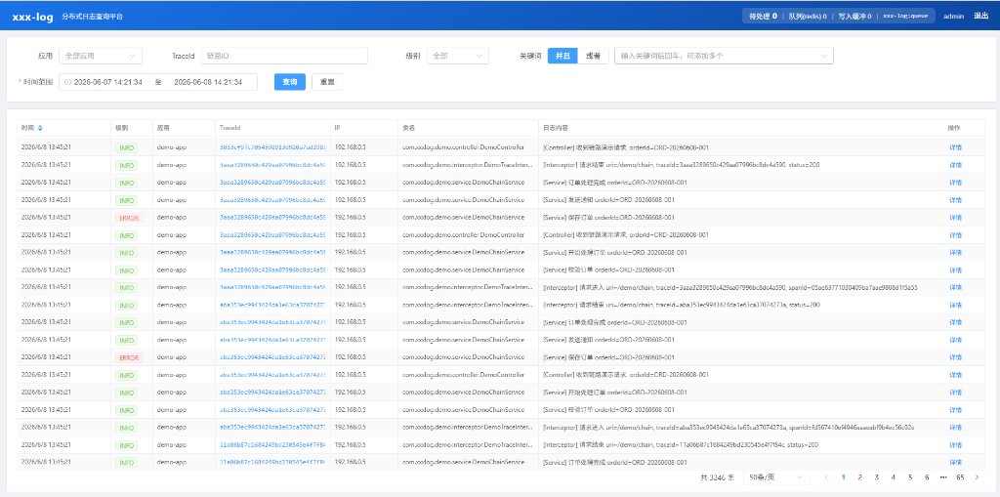
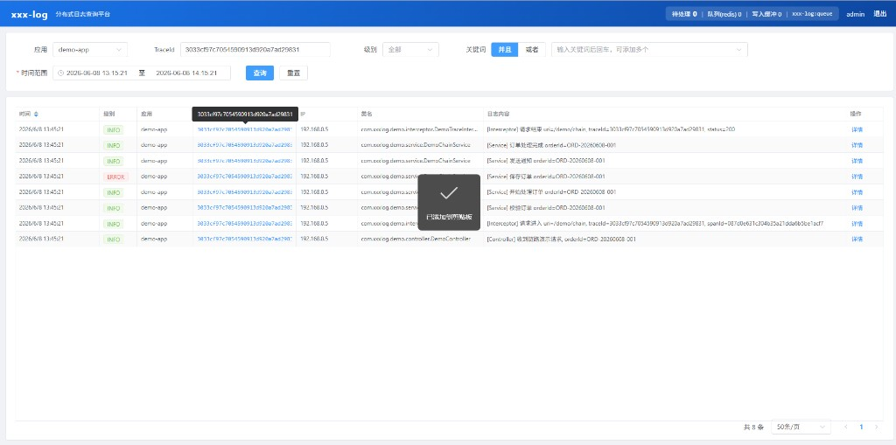
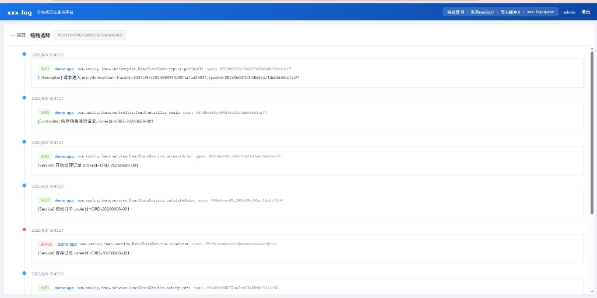
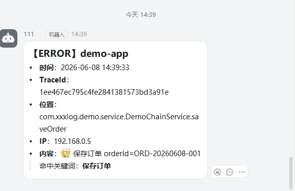
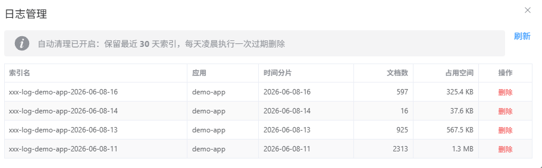
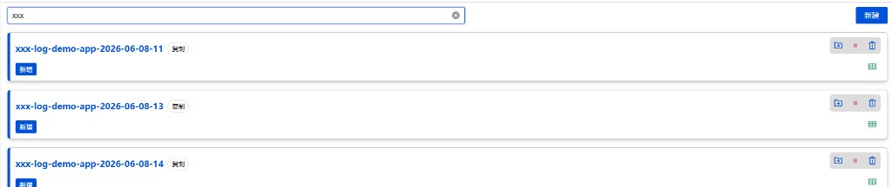

# xxx-log
## 一个简单易用的java分布式日志组件

基于 **JDK 17 服务端 + JDK 8 采集客户端 + Elasticsearch 8** 构建的分布式日志收集与查询系统。

[](LICENSE)

## 技术栈

| 层次 | 技术 | JDK 要求 |
|------|------|----------|
| 日志采集客户端 | Logback Appender + TraceFilter | **JDK 8+** |
| 服务端 | Spring Boot 3.2 + Redis/RabbitMQ + ES 8 | JDK 17+ |
| 前端 | Vue 3 + Vite 4 + Element Plus | Node.js 14.18+（推荐 18+） |

## 版本兼容

| 组件 | 业务项目要求 | 说明 |
|------|-------------|------|
| `xxx-log-client` | **JDK 8+** | 采集端字节码为 Java 8，老项目可直接引用 |
| `xxx-log-client` | Spring Boot 2.x 或 3.x | 自动识别 `javax` / `jakarta` Servlet |
| `xxx-log-client-cloud` | Spring Boot 3 + Spring Cloud | 微服务 Feign/Gateway 链路透传（位于 `xxx-log-demo/client-cloud`） |
| `xxx-log-server` | JDK 17+ | 查询服务与 ES 消费，需 Java 17 运行 |
| Logback | 1.2.x（Boot 2）/ 1.4.x（Boot 3） | Appender 均兼容 |

## 架构

```
Spring Boot 应用 (xxx-log-client)
    │ Logback Appender + TraceFilter
    ▼
Redis 或 RabbitMQ 队列（客户端可选）
    │ 批量消费
    ▼
xxx-log-server
    │ Bulk 写入
    ▼
Elasticsearch (按 时/日/月 拆分索引)
    ▲
xxx-log-web (Vue3 查询界面)
```

## 模块说明

| 模块 | 说明 |
|------|------|
| `xxx-log-common` | 公共模型、枚举、工具类 |
| `xxx-log-client` | 日志采集客户端（Logback Appender + 链路追踪） |
| `xxx-log-server` | 服务端（Redis/RabbitMQ 消费、ES 写入、查询 API） |
| `xxx-log-demo` | 接入示例（`boot` 单体 / `cloud` Spring Cloud / `client-cloud` 链路透传扩展） |
| `xxx-log-web` | Vue3 日志查询前端 |

## 环境要求

**服务端（xxx-log-server / xxx-log-web）：**

- JDK 17+
- Maven 3.8+
- Redis 6+（日志队列或登录 Token 存储，RabbitMQ 模式下 Token 仍用 Redis）
- RabbitMQ 3.x（可选，推荐高吞吐日志场景）
- Elasticsearch 8.x
- Node.js 14.18+（推荐 18+，前端开发）

**业务项目接入采集客户端（xxx-log-client）：**

- JDK 8+（推荐 Spring Boot 2.7+ 或 3.x）
- Logback 1.2+ / 1.4+
- 可访问 Redis 或 RabbitMQ（写入日志队列，与服务端 `queue-type` 一致）

## 队列选型

| 类型 | 适用场景 | 客户端配置 | 服务端配置 |
|------|----------|------------|------------|
| **Redis**（默认） | 小规模、已有 Redis、快速接入 | `<queueType>redis</queueType>` | `queue-type: redis` |
| **RabbitMQ** | 高吞吐、持久化、削峰填谷 | `<queueType>rabbitmq</queueType>` | `queue-type: rabbitmq` |

> **注意：** 客户端与服务端的队列类型、队列名必须一致。登录鉴权 Token 始终存储在 Redis，即使用 RabbitMQ 作日志队列，Redis 仍需部署。

### Redis 模式（默认）

**客户端 logback：**

```xml
<appender name="XXX_LOG" class="com.xxxlog.client.appender.XxxLogAppender">
    <appName>your-app-name</appName>
    <env>prod</env>
    <queueType>redis</queueType>
    <redisHost>127.0.0.1</redisHost>
    <redisPort>6379</redisPort>
    <redisPassword>redis123</redisPassword>
    <queueKey>xxx-log:queue</queueKey>
</appender>
```

**服务端 application.yml：**

```yaml
xxx-log:
  queue-type: redis
  queue-key: xxx-log:queue
```

### RabbitMQ 模式

**客户端 logback：**

```xml
<appender name="XXX_LOG" class="com.xxxlog.client.appender.XxxLogAppender">
    <appName>your-app-name</appName>
    <env>prod</env>
    <queueType>rabbitmq</queueType>
    <rabbitmqHost>127.0.0.1</rabbitmqHost>
    <rabbitmqPort>5672</rabbitmqPort>
    <rabbitmqUsername>admin</rabbitmqUsername>
    <rabbitmqPassword>rabbit123</rabbitmqPassword>
    <rabbitmqQueue>xxx-log.queue</rabbitmqQueue>
</appender>
```

**服务端 application.yml：**

```yaml
xxx-log:
  queue-type: rabbitmq
  rabbitmq:
    queue: xxx-log.queue

spring:
  rabbitmq:
    host: 127.0.0.1
    port: 5672
    username: admin
    password: rabbit123
```

只需修改 `queue-type` 为 `rabbitmq` 即可切换，无需额外 profile。

## 快速开始

### 1. 启动中间件

请自行准备并启动以下组件（配置见 `xxx-log-server/src/main/resources/application.yml`）：

- **Redis** — 日志队列（`queue-type=redis`）及登录 Token 存储
- **Elasticsearch** — 日志持久化与检索
- **RabbitMQ**（可选）— 仅 `queue-type=rabbitmq` 时需要

### 2. 编译并安装到本地仓库

```bash
mvn clean install -DskipTests
```

> 后续若要在其他 Spring Boot 项目中引用 `xxx-log-client`，也必须先执行此步骤，详见 [接入已有 Spring Boot 项目](#接入已有-spring-boot-项目)。

### 3. 启动服务端

```bash
cd xxx-log-server
mvn spring-boot:run
```

服务端默认端口 `8899`，配置文件 `application.yml`。

### 4. 启动 Demo 应用

```bash
cd xxx-log-demo/boot
mvn spring-boot:run
```

访问 `http://localhost:8080/demo/hello?name=test` 产生日志。

### 5. 启动前端

```bash
cd xxx-log-web
npm install
npm run dev
```

访问 `http://localhost:5173`，使用配置文件中的账号密码登录后查询日志。

默认账号：`admin` / `admin123`（可在 `xxx-log-server/application.yml` 中修改）

## 界面预览

### 登录页


### 日志查询

支持按应用、TraceId、级别、关键词、时间范围组合检索；TraceId 点击可填充搜索，日志内容双击查看详情。



按 TraceId 筛选后可快速复制，跳转链路追踪页：



### 链路追踪

按时间线展示同一 TraceId 下各 Span 的调用顺序，ERROR 节点高亮显示：



### 钉钉 ERROR 告警

ERROR 日志命中关键词后，钉钉群机器人实时推送 Markdown 消息（含 TraceId、类名、命中关键词等）：



### 日志管理

顶栏点击 **「日志管理」** 打开弹窗，查看系统内所有日志索引、占用空间，支持手动删除；并展示自动清理策略（默认保留 30 天）：



## 钉钉关键词告警

服务端在日志**写入 ES 时**触发告警检测（`LogBatchWriter.writeJson` / `writeBatch` → `DingTalkAlertService.onLogIngested`），仅针对 **ERROR 级别**日志，异步推送至钉钉群机器人，不阻塞消费线程。

### 触发流程

```
Redis/RabbitMQ 消费
    │
    ▼
LogBatchWriter.writeJson() / writeBatch()
    ├── 直接 bulkWrite ES
    └── DingTalkAlertService.onLogIngested()  [@Async 异步]
            │
            ├─ level != ERROR ──────────────────► 跳过
            ├─ app-names 配置了但当前应用不在列表 ─► 跳过
            ├─ 命中 blacklist-keywords ─────────► 跳过
            ├─ strategy=KEYWORD 且未命中 keywords ► 跳过
            ├─ 冷却期内（min-interval-seconds）──► 跳过
            └─ 通过 ──► DingTalkClient 发送 Markdown 消息
```

### 关键词匹配逻辑（KEYWORD 模式，推荐）

匹配文本由以下字段**拼接**后做**不区分大小写的子串包含**判断：

| 字段 | 说明 |
|------|------|
| `message` | 日志正文 |
| `stackTrace` | 异常堆栈 |
| `className` | 类名 |
| `loggerName` | Logger 名 |

- 配置 `keywords` 列表中**任一**关键词命中即推送，消息中会标注「命中关键词：xxx」
- `blacklist-keywords` 优先级最高，三种策略均生效（如过滤「模拟业务异常」等测试噪声）
- 相同 `应用 + 消息前缀(120字)` 在 `min-interval-seconds` 内只推送一次，防止刷屏

### 推送策略

| 策略 | 说明 |
|------|------|
| `KEYWORD`（推荐） | 仅 ERROR 且命中 `keywords` 时推送 |
| `ALL` | 所有 ERROR 都推送（仍受黑名单过滤） |
| `BLACKLIST` | 除黑名单外所有 ERROR 都推送 |

### 配置示例

在 `xxx-log-server/src/main/resources/application.yml` 中：

```yaml
xxx-log:
  dingtalk:
    enabled: true
    webhook-url: https://oapi.dingtalk.com/robot/send?access_token=YOUR_TOKEN
    secret: ""                    # 机器人加签密钥，未启用加签可留空

    # 日总结：统计昨日 ERROR 总数，按应用分组推送
    daily-summary:
      enabled: true
      cron: "0 0 9 * * ?"         # 默认每天 09:00

    error-alert:
      enabled: true
      strategy: KEYWORD           # ALL | KEYWORD | BLACKLIST
      keywords:                   # KEYWORD 模式生效
        - NullPointerException
        - 支付失败
        - OutOfMemoryError
        - 保存订单                # 例如 demo 中 saveOrder 的 ERROR 会命中此词
      blacklist-keywords:
        - 模拟业务异常
      app-names: []               # 为空=全部应用；可填 demo-app 限定单应用
      min-interval-seconds: 60    # 同类错误最短推送间隔
      max-message-length: 500
      include-stack-trace: true
```

### 钉钉消息示例

ERROR 实时告警效果见上方「界面预览 · 钉钉 ERROR 告警」截图。消息包含：应用名、时间、TraceId、类名/方法、IP、日志内容、堆栈（可选）、命中关键词。

日总结消息包含：昨日日期、ERROR 总数、各应用 ERROR 数表格。

### 排查未收到通知

1. 确认 `enabled=true` 且 `webhook-url` 已填写
2. 确认日志级别为 **ERROR**（WARN/INFO 不触发）
3. KEYWORD 模式下检查 `keywords` 是否能在 message/stackTrace/类名 中找到
4. 检查是否被 `blacklist-keywords` 或冷却时间拦截
5. 将 `com.xxxlog.server.dingtalk` 日志级别改为 `DEBUG` 查看跳过原因

## 登录鉴权

查询接口需要登录后访问。在 `xxx-log-server/application.yml` 中配置：

```yaml
xxx-log:
  auth:
    username: admin
    password: admin123
    token-expire-hours: 24
```

登录成功后服务端签发 Token（存储于 Redis），前端请求时自动携带 `Authorization: Bearer {token}`。

## 接入已有 Spring Boot 项目

> **注意：** 本项目未发布到 Maven 中央仓库，无法直接在业务项目的 `pom.xml` 里拉取依赖。需要先将 `xxx-log-client` **安装到本地 Maven 仓库**，再在业务项目中引用。

### 1. 安装 client 到本地仓库

在 **xxx-log 项目根目录** 执行（会一并编译并 install 所有模块）：

```bash
mvn clean install -DskipTests
```

成功后，本地仓库（一般为 `~/.m2/repository/com/xxxlog/`）会出现：

- `xxx-log-common/1.0.0-SNAPSHOT/`
- `xxx-log-client/1.0.0-SNAPSHOT/`

也可只安装 client 及其依赖：

```bash
mvn clean install -pl xxx-log-client -am -DskipTests
```

### 2. 在业务项目中添加依赖

本地 install 完成后，在**你的 Spring Boot 项目** `pom.xml` 中添加（**JDK 8 项目同样适用**）：

```xml
<dependency>
    <groupId>com.xxxlog</groupId>
    <artifactId>xxx-log-client</artifactId>
    <version>1.0.0-SNAPSHOT</version>
</dependency>
```

> Redis 模式（默认）会自动传递 `lettuce-core` 依赖。若使用 RabbitMQ 队列，需额外添加：
>
> ```xml
> <dependency>
>     <groupId>com.rabbitmq</groupId>
>     <artifactId>amqp-client</artifactId>
>     <version>5.20.0</version>
> </dependency>
> ```

> Spring Boot 2.x 使用 `javax.servlet`，Boot 3.x 使用 `jakarta.servlet`，客户端会自动注册对应的 TraceFilter，无需额外配置。

若 IDE 仍提示找不到依赖，请刷新 Maven（IDEA：**Reload Project**）。

### 3. 配置 logback-spring.xml

**推荐**：密码等敏感信息放 `application.yml`，logback 用 `springProperty` 引用（支持 `@`、`&` 等特殊字符）：

```yaml
# application.yml
xxx-log:
  redis-host: 127.0.0.1
  redis-port: 6379
  redis-database: 0
  redis-password: "z6@Q3sF&8n"   # 含特殊字符时用双引号包裹
```

```xml
<springProperty scope="context" name="redisHost" source="xxx-log.redis-host" defaultValue="127.0.0.1"/>
<springProperty scope="context" name="redisPort" source="xxx-log.redis-port" defaultValue="6379"/>
<springProperty scope="context" name="redisDatabase" source="xxx-log.redis-database" defaultValue="0"/>
<springProperty scope="context" name="redisPassword" source="xxx-log.redis-password" defaultValue=""/>

<appender name="XXX_LOG" class="com.xxxlog.client.appender.XxxLogAppender">
    <appName>your-app-name</appName>
    <env>prod</env>
    <queueType>redis</queueType>
    <redisHost>${redisHost}</redisHost>
    <redisPort>${redisPort}</redisPort>
    <redisDatabase>${redisDatabase}</redisDatabase>
    <redisPassword>${redisPassword}</redisPassword>
    <queueKey>xxx-log:queue</queueKey>
</appender>
```

若必须写在 XML 里，`&` 需转义为 `&amp;`，或使用 CDATA：

```xml
<redisPassword><![CDATA[z6@Q3sF&8n]]></redisPassword>
```

> Java 客户端（Lettuce）对特殊字符密码无需额外编码；问题通常出在 XML/YAML 配置解析阶段。

### 4. 启用链路追踪（可选）

```yaml
xxx-log:
  trace-enabled: true
  trace-mode: native   # native | compatible | micrometer
  app-name: your-app-name
  env: prod
```

TraceFilter 会自动注册，HTTP 请求会生成/透传 `X-Trace-Id` 头。

## Spring Cloud 微服务接入

单体项目使用默认 `trace-mode: native` 即可。Spring Cloud 微服务建议：

```yaml
xxx-log:
  trace-mode: compatible   # 同时读写 X-Trace-Id / B3 / W3C
```

并增加 cloud 扩展依赖：

```xml
<dependency>
    <groupId>com.xxxlog</groupId>
    <artifactId>xxx-log-client-cloud</artifactId>
    <version>1.0.0-SNAPSHOT</version>
</dependency>
<dependency>
    <groupId>org.springframework.cloud</groupId>
    <artifactId>spring-cloud-starter-openfeign</artifactId>
</dependency>
```

`xxx-log-client-cloud` 会自动注册：

| 组件 | 能力 |
|------|------|
| OpenFeign | 出站请求透传 traceId |
| RestTemplate | 同上 |
| WebClient | 同上 |
| Spring Cloud Gateway | 入口解析 + 向下游透传 |
| @Async 线程池 | MDC 上下文透传 |

若项目已接入 **Micrometer Tracing**，可设置 `trace-mode: micrometer`，关闭内置 TraceFilter，由 Micrometer 写入 MDC，`XxxLogAppender` 仍可正常采集。

**Gateway 项目**只需依赖 `xxx-log-client` + `xxx-log-client-cloud`，无需 Servlet TraceFilter。

**示例：**

```bash
cd xxx-log-demo/cloud
mvn spring-boot:run
# 访问 http://localhost:8080/demo/feign 观察上下游 traceId 一致
```

### 方式二：直接引用本地 JAR（不推荐，无 Maven 时可用）

若不方便使用 `mvn install`，可手动拷贝 JAR 到业务项目，例如 `lib/xxx-log-client-1.0.0-SNAPSHOT.jar`（需同时拷贝 `xxx-log-common` 依赖或打 fat jar），并在 `pom.xml` 中使用：

```xml
<dependency>
    <groupId>com.xxxlog</groupId>
    <artifactId>xxx-log-client</artifactId>
    <version>1.0.0-SNAPSHOT</version>
    <scope>system</scope>
    <systemPath>${project.basedir}/lib/xxx-log-client-1.0.0-SNAPSHOT.jar</systemPath>
</dependency>
```

`system` 作用域不会传递依赖，需自行处理 `xxx-log-common` 等传递库，**优先建议使用方式一（本地 install）**。

## 索引拆分配置

在 `xxx-log-server` 的 `application.yml` 中配置：

```yaml
xxx-log:
  index-prefix: xxx-log
  index-split-type: DAY   # HOUR | DAY | MONTH
```

索引命名规则：`{prefix}-{appName}-{timeSuffix}`

- HOUR: `xxx-log-demo-app-2026-06-08-14`
- DAY:  `xxx-log-demo-app-2026-06-08`
- MONTH: `xxx-log-demo-app-2026-06`

### 索引保存效果

配置 `index-split-type: HOUR` 时，日志按应用 + 小时自动创建 ES 索引，例如 demo 应用写入后可在 ES 中看到：



### 日志索引管理与自动清理

**Web 控制台**：登录后顶栏 **日志管理** → 查看索引列表（名称、应用、时间分片、文档数、占用空间），可手动删除单个索引。

**自动过期删除**（`application.yml`）：

```yaml
xxx-log:
  index-retention:
    enabled: true
    days: 30                 # 保留天数，超出自动删除
    cron: "0 0 2 * * ?"      # 每天 02:00 执行一次
  lock:
    index-retention-ttl-seconds: 600   # 集群下 Redis 锁，避免多节点重复清理
```

- 按索引名解析时间分片（HOUR / DAY / MONTH），早于 `days` 的索引会被删除
- 仅删除 `{index-prefix}-*` 开头的本项目索引，不影响 ES 中其他索引
- 集群部署时通过 Redis 分布式锁保证清理任务单节点执行

## API 接口

| 方法 | 路径 | 说明 | 鉴权 |
|------|------|------|------|
| POST | `/api/auth/login` | 登录 | 否 |
| POST | `/api/auth/logout` | 退出 | 是 |
| GET | `/api/auth/me` | 当前用户 | 是 |
| POST | `/api/logs/search` | 分页查询日志 | 是 |
| GET | `/api/logs/trace/{traceId}` | 按链路 ID 查询 | 是 |
| GET | `/api/logs/apps` | 获取应用列表 | 是 |
| GET | `/api/logs/queue/stats` | 队列与缓冲待处理数 | 是 |
| GET | `/api/logs/indices` | 日志索引列表及保留策略 | 是 |
| DELETE | `/api/logs/indices/{indexName}` | 删除指定日志索引 | 是 |

## 核心特性

- 清晰的多模块分层，职责单一
- **采集客户端 JDK 8 编译**，兼容 Spring Boot 2.x / 3.x 业务项目
- 服务端基于 JDK 17 + Spring Boot 3，采用当前主流技术栈
- 使用 ES Java API Client 8.x，类型安全
- 链路追踪基于标准 MDC + HTTP Header 透传
- 客户端可选 Redis / RabbitMQ 队列，异步批量推送，不阻塞业务线程
- 支持 Spring Cloud 微服务链路透传（Feign / Gateway / B3 / W3C）
- Vue3 + Element Plus 现代化查询界面
- 索引拆分策略可配置（时/日/月）
- **日志索引管理**：Web 控制台查看/删除索引，可配置保留天数自动清理
- **钉钉机器人**：ERROR 关键词实时告警 + 每日 ERROR 日总结

## 开源协议

本项目采用 [MIT License](LICENSE) 开源。
